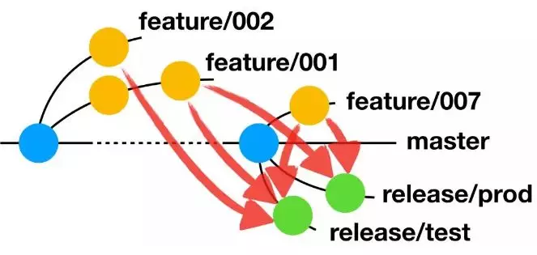
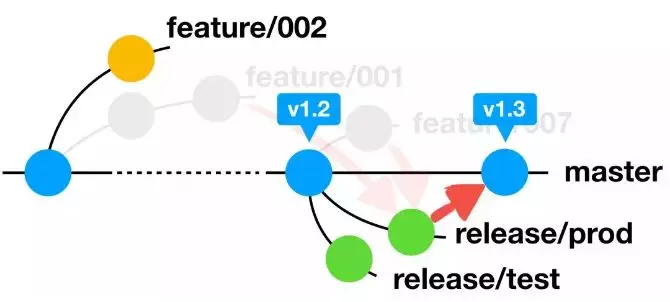

[参考](http://mp.weixin.qq.com/s/JsBX3UPgZL_HUOTCIopr_A)

在 AoneFlow 上你能看到许多其他分支模式的影子。它基本上兼顾了 TrunkBased 的“易于持续集成”和 GitFlow 的“易于管理需求”特点，同时规避掉 GitFlow 的那些繁文缛节。

看一下具体套路。AoneFlow 只使用三种分支类型：主干分支、特性分支、发布分支，以及三条基本规则。

规则一，开始工作前，从主干创建特性分支。

AoneFlow 的特性分支基本借鉴 GitFlow，没有什么特别之处。每当开始一件新的工作项（比如新的功能或是待解决的问题）的时候，从代表最新已发布版本的主干上创建一个通常以feature/前缀命名的特性分支，然后在这个分支上提交代码修改。也就是说，每个工作项（可以是一个人完成，或是多个人协作完成）对应一个特性分支，所有的修改都不允许直接提交到主干。

规则二，通过合并特性分支，形成发布分支。

AoneFlow 的发布分支设计十分巧妙，可谓整个体系的精髓。GitFlow 先将已经完成的特性分支合并回公共主线（即开发分支），然后从公共主线拉出发布分支。TrunkBased 同样是等所有需要的特性都在主干分支上开发完成，然后从主干分支的特定位置拉出发布分支。而 AoneFlow 的思路是，从主干上拉出一条新分支，将所有本次要集成或发布的特性分支依次合并过去，从而得到发布分支。发布分支通常以release/前缀命名。

这条规则很简单，不过实际的玩法就相当丰富了。

首先，发布分支的用途可以很灵活。基础玩法是将每条发布分支与具体的环境相对应，比如release/test分支对应部署测试环境，release/prod分支对应线上正式环境等等，并与流水线工具相结合，串联各个环境上的代码质量扫描和自动化测试关卡，将产出的部署包直接发布到相应环境上。进阶点的玩法是将一个发布分支对应多个环境，比如把灰度发布和正式发布串在一起，中间加上人工验收的步骤。高级的玩法呢，要是按迭代计划来关联特性分支，创建出以迭代演进的固定发布分支，再把一系列环境都串在这个发布分支的流水线上，就有点经典持续集成流水线的味道了。再或者做一个将所有特性分支都关联在一起的发布分支，专门用于对所有提交做集成测试，就玩出了 TrunkBased 的效果。当然，这些花哨的高级玩法是我臆想的，阿里的发布分支一般都还是比较中规中矩。

其次，发布分支的特性组成是动态的，调整起来特别容易。在一些市场瞬息万变的互联网企业，以及采用“敏捷运作”的乙方企业经常会遇到这种情况，已经完成就等待上线的需求，随时可能由于市场策略调整或者甲方的一个临时决定，其中某个功能忽然要求延迟发布或者干脆不要了。再或者是某个特性在上线前发现存在严重的开发问题，需要排除。按往常的做法，这时候就要来手工“剔代码”了，将已经合并到开发分支或者主干分支的相关提交一个个剔除出去，做过的同学都知道很麻烦。在 AoneFlow 的模式下，重建发布分支只是分分钟的事，将原本的发布分支删掉，从主干拉出新的同名发布分支，再把需要保留的各特性分支合并过来就搞定。这一系列动作能够在很大程度上实现自动化，而且不会在仓库留下一堆剔除代码的记录，干净无污染。

此外，发布分支之间是松耦合的，这样就可以有多个集成环境分别进行不同的特性组合的集成测试，也能方便地管理各个特性进入到不同环境上部署的时机。松耦合并不代表没有相关性，由于测试环境、集成环境、预发布环境、灰度环境和线上正式环境等发布流程通常是顺序进行的，在流程上可以要求只有通过前一环境验证的特性，才能传递到下一个环境做部署，形成漏斗形的特性发布流。阿里有统一平台来自动化完成特性组合在发布分支间的迁移，在下面讲工具的部分里会再介绍。

规则三，发布到线上正式环境后，合并相应的发布分支到主干，在主干添加标签，同时删除该发布分支关联的特性分支。

当一条发布分支上的流水线完成了一次线上正式环境的部署，就意味着相应的功能真正地发布了，此时应该将这条发布分支合并到主干。为了避免在代码仓库里堆积大量历史上的特性分支，还应该清理掉已经上线部分特性分支。与 GitFlow 相似，主干分支上的最新版本始终与线上版本一致，如果要回溯历史版本，只需在主干分支上找到相应的版本标签即可。

除了基本规则，还有一些实际操作中不成文的技巧。比如上线后的 Hotfix，正常的处理方法应该是，创建一条新的发布分支，对应线上环境（相当于 Hotfix 分支），同时为这个分支创建临时流水线，以保障必要的发布前检查和冒烟测试能够自动执行。但其实还有一种简便方法是，将线上正式环境对应的发布分支上关联的特性分支全部清退掉，在这个发布分支上直接进行修改，改完利用现成的流水线自动发布。如果非得修一个历史版本的 Bug 怎么办呢？那就老老实实地在主干分支找到版本标签位置，然后从那个位置创建 Hotfix 分支吧，不过由于阿里的产品大多是线上 SaaS 业务，这样的场景并不多见。

正是这些简单的规则，组成了 AoneFlow 独树一帜的核心套路。